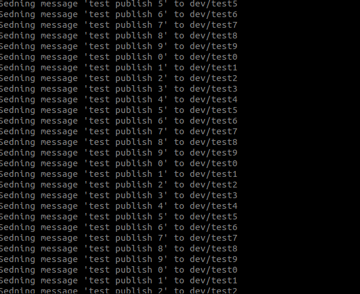

# MQTT_Mosquito_local
1. Установка mosquitto mqtt как брокер: `sudo apt-get install mosquitto`

2. Написать паблишер, который изменяет счетчик от 0 до 10 и обратно в бесконечном цикле

3. Результат

